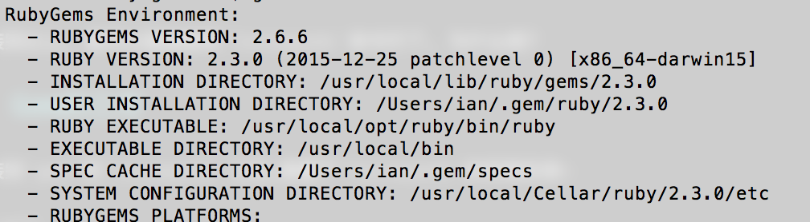
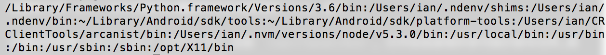
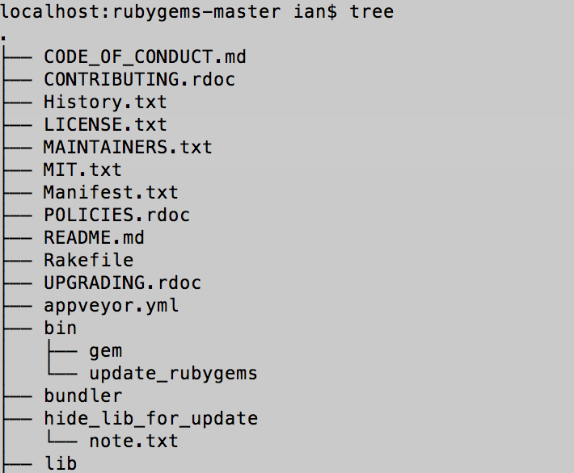

> 本篇内容工作环境在Mac OS下


做iOS开发的同学都知道[`Cocoapods`](https://cocoapods.org/),一个非常棒的包管理工具,最常用的命令基本上就是命令行工具了, 例如: `pod init`, `pod install`, `pod update`等等.但是这些命令行工具是怎么样运行的呢? 内部执行了什么命令呢? 下面让我们一起从头开始看:

## 安装

首先需要安装`Cocoapods`, 详细教程请移步[官网](https://cocoapods.org/).

```shell
>$ sudo gem install cocoapods
```
从这个命令可以看到使用了`gem`命令工具集的`install`命令, 带有`cocoapods`参数
那么`gem`命令工具集是什么? 

当然大家肯定都知道是`RubyGem`,它是一个`Ruby`的包管理工具, 详细见[官网](https://rubygems.org)

gem安装命令:

```shell
>$ gem update --system          # may need to be administrator or root
```

当安装完以上, 就可以直接使用`Cocoapods`命令行了, 为什么呢?

## Gem的工作

当安装完`gem`和`Cocoapods`之后,查看下`Cocoapods`的安装目录:

```shell
>$ gem environment
```



从输出中找到 `INSTALLATION DIRECTORY`路径, 因为版本不同可能路径不尽相同, 大致是这样的: 

`/usr/local/lib/ruby/gems/2.3.0`

在路径下的`gems`文件夹就可以看到所有本地安装的`Ruby`包了

从输出中找到`EXECUTABLE DIRECTORY`目录 `/usr/local/bin`, 打开后会发现许多可执行命令文件,其中就包含了`pod`这个我们使用的命令工具

这个`pod`命令工具就是Gem在安装`cocoapods`的时候生成在`/usr/local/bin`


> Terminal启动后, bash在执行命令的时候都会在系统路径中查找命令是否存在

接下来, 查看一下系统路径: `$PATH`

```shell
>$ echo $PATH
```



从输出结果可以看到`/usr/local/bin`路径是在系统环境变量中的, 所以目录下的可执行文件可以被`bash`找到并执行

至此,已经看到了可以在命令行中使用`pod`命令的原因[微笑], 这就完了么?

往下看, `gem`是如何生成`pod`命令文件的? `pod`命令行工具的命令是如何执行的呢?

## .gemspec文件

要使用`Gem`来管理`Ruby`包, 就需要编写`gemspec`文件, 来看下`cocoapods`的`gemspec`文件

```ruby
# encoding: UTF-8
require File.expand_path('../lib/cocoapods/gem_version', __FILE__)
require 'date'

Gem::Specification.new do |s|
  s.name     = "cocoapods"
  s.version  = Pod::VERSION
  s.date     = Date.today
  s.license  = "MIT"
  s.email    = ["eloy.de.enige@gmail.com", "fabiopelosin@gmail.com", "kyle@fuller.li", "segiddins@segiddins.me"]
  s.homepage = "https://github.com/CocoaPods/CocoaPods"
  s.authors  = ["Eloy Duran", "Fabio Pelosin", "Kyle Fuller", "Samuel Giddins"]

  s.summary     = "The Cocoa library package manager."
  s.description = "CocoaPods manages library dependencies for your Xcode project.\n\n"     \
                  "You specify the dependencies for your project in one easy text file. "  \
                  "CocoaPods resolves dependencies between libraries, fetches source "     \
                  "code for the dependencies, and creates and maintains an Xcode "         \
                  "workspace to build your project.\n\n"                                   \
                  "Ultimately, the goal is to improve discoverability of, and engagement " \
                  "in, third party open-source libraries, by creating a more centralized " \
                  "ecosystem."

  s.files = Dir["lib/**/*.rb"] + %w{ bin/pod bin/sandbox-pod README.md LICENSE CHANGELOG.md }

  s.executables   = %w{ pod sandbox-pod }
  s.require_paths = %w{ lib }

  # Link with the version of CocoaPods-Core
  s.add_runtime_dependency 'cocoapods-core',        "= #{Pod::VERSION}"

  s.add_runtime_dependency 'claide',                '>= 1.0.2', '< 2.0'
  s.add_runtime_dependency 'cocoapods-deintegrate', '>= 1.0.2', '< 2.0'
  s.add_runtime_dependency 'cocoapods-downloader',  '>= 1.2.0', '< 2.0'
  s.add_runtime_dependency 'cocoapods-plugins',     '>= 1.0.0', '< 2.0'
  s.add_runtime_dependency 'cocoapods-search',      '>= 1.0.0', '< 2.0'
  s.add_runtime_dependency 'cocoapods-stats',       '>= 1.0.0', '< 2.0'
  s.add_runtime_dependency 'cocoapods-trunk',       '>= 1.3.0', '< 2.0'
  s.add_runtime_dependency 'cocoapods-try',         '>= 1.1.0', '< 2.0'
  s.add_runtime_dependency 'molinillo',             '~> 0.6.5'
  s.add_runtime_dependency 'xcodeproj',             '>= 1.5.7', '< 2.0'

  ## Version 5 needs Ruby 2.2, so we specify an upper bound to stay compatible with system ruby
  s.add_runtime_dependency 'activesupport', '>= 4.0.2', '< 5'
  s.add_runtime_dependency 'colored2',       '~> 3.1'
  s.add_runtime_dependency 'escape',        '~> 0.0.4'
  s.add_runtime_dependency 'fourflusher',   '~> 2.0.1'
  s.add_runtime_dependency 'gh_inspector',  '~> 1.0'
  s.add_runtime_dependency 'nap',           '~> 1.0'
  s.add_runtime_dependency 'ruby-macho',    '~> 1.1'

  s.add_development_dependency 'bacon', '~> 1.1'
  s.add_development_dependency 'bundler', '~> 1.3'
  s.add_development_dependency 'rake', '~> 10.0'

  ## Make sure you can build the gem on older versions of RubyGems too:
  s.rubygems_version = "1.6.2"
  s.required_rubygems_version = Gem::Requirement.new(">= 0") if s.respond_to? :required_rubygems_version=
  s.required_ruby_version = '>= 2.0.0'
  s.specification_version = 3 if s.respond_to? :specification_version
end

```

文件中只做了一件事情, 就是初始化了一个`Specification`类的对象, 并为这个对象配置了各种参数

其中我们注意到 `pod`命令是赋值给了 `s.executables`, `Sepcification`对象的`executables`接收一个数组,其中包含了可执行的命令行工具文件, 这些文件必须放在根目录的`bin`文件夹下面,这个是`RubyGem`的规范, 具体可以查看官网

我们继续

找到`RubyGem`[源码](https://github.com/rubygems/rubygems)

	

我们从

```shell
>$ sudo gem install cocoapods
```

这条指令开始看一下`RubyGem`是如何创建`pod`命令行文件的

打开`/bin/gem`文件

```ruby
#!/usr/bin/env ruby
#--
# Copyright 2006 by Chad Fowler, Rich Kilmer, Jim Weirich and others.
# All rights reserved.
# See LICENSE.txt for permissions.
#++

require 'rubygems'
require 'rubygems/gem_runner'
require 'rubygems/exceptions'

required_version = Gem::Requirement.new ">= 1.8.7"

unless required_version.satisfied_by? Gem.ruby_version then
  abort "Expected Ruby version #{required_version}, is #{Gem.ruby_version}"
end

args = ARGV.clone

begin
  Gem::GemRunner.new.run args
rescue Gem::SystemExitException => e
  exit e.exit_code
end

```

> `gem`命令调用了 `Gem::GemRunner`的`run`方法,并传入了命令参数
> >打开`gem_runner.rb`的`run`方法可以看到,根据参数做了分发指令的操作,会调用到`/lib/rubygem/commands/xxx_command.rb`, 这里调用了`install`命令, 所以打开`install_command.rb`文件, 调用到`execute`方法
> > > `install_command.rb`在安装的时候会调用`/lib/rubygem/install.rb`中的`install`方法,这里是hook的地方,可以允许用户按照规则在安装前后进行一些操作
> > > > **最终** 执行了`install.rb`中的`generate_bin`方法,生成了我们在CLI中调用的可执行文件,这里是根据`gemspec`文件中`s.executables   = %w{ pod sandbox-pod }`指定的两个命令行工具
来生成的
>  

Over~


## pod命令的工作

但是,例如当我们执行`pod init`的时候, 又是如何工作的呢?

这个就比较容易了, 照例我们打开(根据你的bin目录)`/usr/local/bin/pod`文件

```ruby
#!/usr/local/opt/ruby/bin/ruby
# 
# This file was generated by RubyGems.
#
# The application 'cocoapods' is installed as part of a gem, and
# this file is here to facilitate running it.
#

require 'rubygems'

version = ">= 0.a"

if ARGV.first
  str = ARGV.first
  str = str.dup.force_encoding("BINARY") if str.respond_to? :force_encoding
  if str =~ /\A_(.*)_\z/ and Gem::Version.correct?($1) then
    version = $1
    ARGV.shift
  end
end

load Gem.activate_bin_path('cocoapods', 'pod', version)
```
可以看到最后一行调用了`Gem`的`activate_bin_path`方法,参数的意思是寻找包名为`cocoapods`的`pod`命令, `Gem`会在gems的安装目录中寻找这个包,然后调用包中`/bin/`下的相应命令文件,在这里会调用`/usr/local/lib/ruby/gems/2.3.0/gems/cocoapods-1.5.0/bin`目录下的`pod`文件

**总结:所有通过Gem安装的工具,最终会通过Gem找到安装目录中的源码bin目录下的相应文件执行**

然后, 打开`cocoapods`源码中的`pod`命令文件

```ruby
#!/usr/bin/env ruby

if Encoding.default_external != Encoding::UTF_8

  if ARGV.include? '--no-ansi'
    STDERR.puts <<-DOC
    WARNING: CocoaPods requires your terminal to be using UTF-8 encoding.
    Consider adding the following to ~/.profile:

    export LANG=en_US.UTF-8
    DOC
  else
    STDERR.puts <<-DOC
    \e[33mWARNING: CocoaPods requires your terminal to be using UTF-8 encoding.
    Consider adding the following to ~/.profile:

    export LANG=en_US.UTF-8
    \e[0m
    DOC
  end

end

if $PROGRAM_NAME == __FILE__ && !ENV['COCOAPODS_NO_BUNDLER']
  ENV['BUNDLE_GEMFILE'] = File.expand_path('../../Gemfile', __FILE__)
  require 'rubygems'
  require 'bundler/setup'
  $LOAD_PATH.unshift File.expand_path('../../lib', __FILE__)
elsif ENV['COCOAPODS_NO_BUNDLER']
  require 'rubygems'
  gem 'cocoapods'
end

STDOUT.sync = true if ENV['CP_STDOUT_SYNC'] == 'TRUE'

require 'cocoapods'

if profile_filename = ENV['PROFILE']
  require 'ruby-prof'
  reporter =
    case (profile_extname = File.extname(profile_filename))
    when '.txt'
      RubyProf::FlatPrinterWithLineNumbers
    when '.html'
      RubyProf::GraphHtmlPrinter
    when '.callgrind'
      RubyProf::CallTreePrinter
    else
      raise "Unknown profiler format indicated by extension: #{profile_extname}"
    end
  File.open(profile_filename, 'w') do |io|
    reporter.new(RubyProf.profile { Pod::Command.run(ARGV) }).print(io)
  end
else
  Pod::Command.run(ARGV)
end

```

哈哈, 看到文件中经过一些判断后, 最终执行了 `Pod::Command`的`run`方法,这里又调用了`/lib/cocoapods/command/init.rb`文件的`run`方法, 完成创建`Podfile`文件操作


最后, 经过`RubyGem`的安装调度,回调到某个`gem`的源码中执行命令


