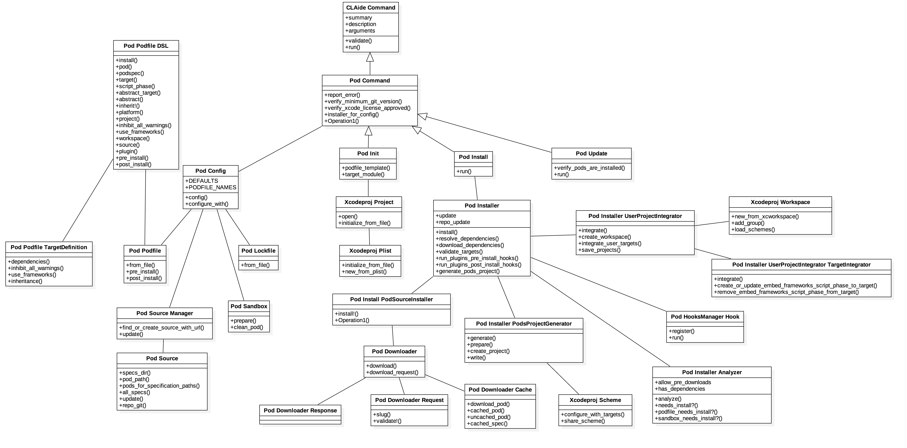
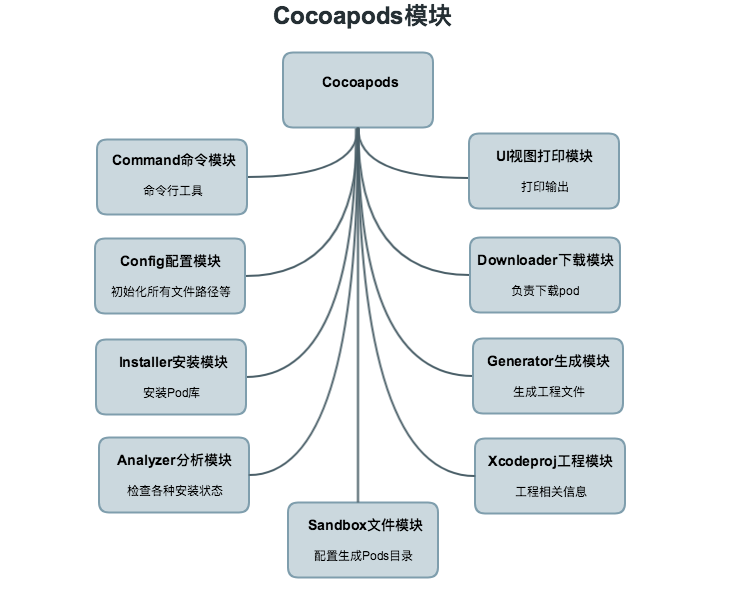

iOS开发者多少都使用过`cocoapods`来管理第三方依赖, 这里就对`cocoapods`的源码分析一下, 深入观察它是如何管理第三方依赖包的?

## DSL

要了解Cocoapods的源码, 首先还得了解下 **领域特定语言 DSL(domain-specific languages)**

为什么呢?

因为我们使用Cocoapods的时候编辑的`Podfile`文件的内容就属于DSL范畴了

[DSL](https://en.wikipedia.org/wiki/Domain-specific_language) 大致解释是:在模型之上建立的一种更加灵活的对模型化的理解和使用方式.

翻译过来的个人理解就是: 一种mini语言, 和通用编程语言不太一样,用于特定领域, 特定用途的语言,能够做到简单,易于理解的解决特定问题.

对于Cocoapods来说, `Podfile`的编写规范就是一种DSL, 它是基于`Ruby`基础上制定的,所以很轻量易懂.

Cocoapods的`Podfile`规范在这里 https://guides.cocoapods.org/syntax/podfile.html

## Cocopods源码模块

## Cocoapods源码解析

从`pod init`命令入手, 

`Installer`类主要负责将`Podfile`文件转换成`Pods`库,生成`.xcworkspace`工程文件,配置好第三方库的依赖, 它主要从三个文件获取配置信息:

- **Podfile**   用户编写的包含`Target`和`Pod`信息的文件
- **Podfile.lock** 包含了上次安装Pod的版本信息, 但是在update模式下被忽略
- **Manifest.lock** 在`Pods`文件夹下,用来判断某个版本是否被安装过, 是`Podfile.lock`的拷贝

当install的时候会执行以下动作:

1. 初始化全局config, 将Podfile执行解析成对象, 通过`eval`执行
2. prepare 准备工作
	- 检查安装目录,必须在项目根目录
	- 检查`Podfile.lock`文件`cocoapods`版本,如果主版本不一样, 会重新集成cocoapods
	- 创建安装目录`Pods`及子目录
	- 检查`Podfile`中的`plugin`插件都已经安装并加载
	- 加载插件
3. resolve_dependencies 解决依赖
	- 检查是否需要更新`pod`source源
	- 如果`Podfile`中有删除的库, 进行清理文件
4. download_dependencies 下载依赖库
	- 下载各个`pod`库
	- 执行`Podfile`中`pre_install`钩子方法
5. validate_targets 验证`target`和`pod`正确
6. generate_pods_project 生成`'Pods/Pods.xcodeproj`工程
	- 调用`Podfile`中`post_install`钩子方法
	- 生成`Pods`工程
	- 生成`Podfile.lock`文件和`Manifest.lock`文件
7. integrate_user_project 集成
	- 创建`.xcworkspace`文件
	- 集成`Target`
	- 警告检查
	- 保存`.xcworkspace`文件到目录
8. 调用`plugin`的`post_install`钩子方法

- 如何解析podfile文件

