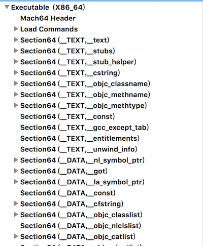
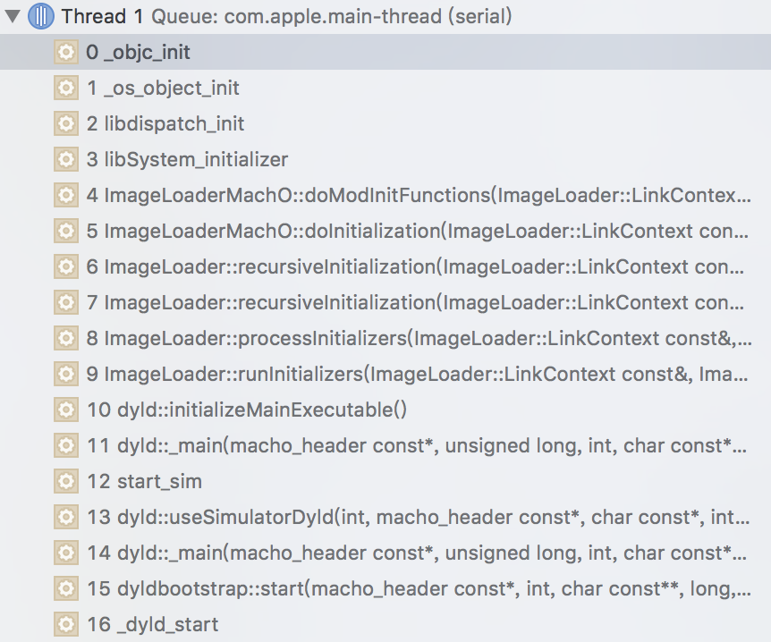

在iOS应用启动的时候,我们都知道入口函数是`main.m`的main方法:

`int main(int argc, char * argv[]) {...}`

但是这只是从应用层面上的入口,在这之前,系统加载的过程是非常值得我们了解和运用的


当应用程序被打开的时候,kernel就会将应用程序加载到内存中,然后kernel会加载另一个程序,就是我们的**dyld(动态连接器)**,不论是我们的应用还是dyld都是一个可执行的程序,在Mac OS和iOS上称作**`Mach-O`**


## Mach-O

简单介绍下`Mach-O`文件内容,就拿我们的app来说,找到编译后的`xxx.app`文件,这里是`Test.app`,包内有个`Test`执行文件,就是我们要找的`Mach-O`文件,这里使用`MachOView`这个软件来打开它,看看内部结构




从图中可以看到,大致分成了下面三部分(segment),其他的部分这里先不说

```
|------------|
|   __TEXT   |  只读
|------------|		  
| 		  	 |
|   __DATA   |	读写
|------------|
|	    	 |
| __LINKEDIT |	只读
|		     |
|------------|
```


- __TEXT: 只读区域,包含了Mach Header,机器指令,只读的常量,执行代码等
- __DATA: 读写区域,包含了全局,静态变量,rebase的指针(后面会讲)
- __LINKEDIT: 只读区域,包含了如何加载程序,页面的Hash值(在内容签名的时候生成的),方法的参数名和地址等


其中每个区域都有多个页结构,因为iOS中的内存使用虚拟内存,使用了页式存储,在加载的时候也是需要按照页来加载,每个页的大小在arm64上是16K,其他的是4K大小


## 虚拟内存

提到虚拟内存,虽然作者没深入过,但是参考文档来的内容需要说下关于应用启动有几个点需要提一下:

基本原理: 由于物理内存有限,将物理内存映射成更大的虚拟内存,每个进程有独立的虚拟内存,需要进行文件操作的时候才真正计算出物理内存地址进行读写.

- 在iOS中也是将Mach-O文件布局在虚拟内存中,使用页式管理虚拟内存
- 通过缺页中断来与物理内存读写
- 页可共享在多个进程中
- 采取了ASLR,对缓冲区溢出的安全保护技术,加载到虚拟内存页中的应用程序地址被随机化了,所以后面的dyld需要创建访问指针
- 采取了代码签名,为每一页内容进行Hash签名


下面是虚拟内存加载我们的应用的内存模型:

```
|------------|	0x000000			
|   PAGEZERO |				--> 防止NULL指针, 不可读写和执行
|------------|	0x???000	  
| 	 App	 |				--> app
|------------|  0x???000	  
|	 A.dylib |				--> app依赖的所有动态库
|------------|  0x???000	  
|	 dyld    |				--> 负责加载所有动态库
|------------|
```

一个dylib加载到内存的过程大致可以分成:

> -> **加载Mach-O header**  		:里面包含应用程序的说明信息
> 
> -> **加载LINKEDIT的内容** 			:包含如何加载数据内容及方法名和地址
> 
> -> **加载DATA数据**				:加载数据到__DATA段,进行读写
> 
> -> **卸载LINKEDIT内容**	:因为加载完数据后,这部分内容不需要再使用了,可以卸载掉


说了这么多,还是没进入主题??...
 
下面就涉及到了我们的主角: dyld程序,万幸这是个开源程序,[在这里看源码](https://github.com/opensource-apple/dyld)

## dyld的工作

应用程序在`main()`之前所做的工作大致可以分成几个步骤:

1. kernel准备环境,将应用程序装载到内存中
2. kernel装载dyld程序,并调用dyld进行应用初始化操作
3. load dylibs 根据Mach-O的`Load Commands`段加载所有依赖的动态库
4. rebase 将经过ASLR随机偏移过的访问首地址创建偏移指针并存储到__DATA段,方便后续访问使用
5. bind 将应用程序内调用外部的指令绑定起来
6. Objc 调用Objc的runtime环境并初始化,处理category和调用`+load()`方法
7. initializers 调用所有动态库的initializer方法,初始化动态库
8. call main() 调用app入口函数`main`

我们先在工程中断点打在`_objc_init`方法,来看一下dyld做的事情



### dyld启动

dyld的执行从`dyldStartup.s`汇编文件开始,

```
	...
	
__dyld_start:
	popq	%rdi		# param1 = mh of app
	pushq	$0		# push a zero for debugger end of frames marker
	movq	%rsp,%rbp	# pointer to base of kernel frame
	andq    $-16,%rsp       # force SSE alignment
	subq	$16,%rsp	# room for local variables
	
	# call dyldbootstrap::start(app_mh, argc, argv, slide, dyld_mh, &startGlue)
	movl	8(%rbp),%esi	# param2 = argc into %esi
	leaq	16(%rbp),%rdx	# param3 = &argv[0] into %rdx
	movq	__dyld_start_static(%rip), %r8
	leaq	__dyld_start(%rip), %rcx
	subq	 %r8, %rcx	# param4 = slide into %rcx
	leaq	___dso_handle(%rip),%r8 # param5 = dyldsMachHeader
	leaq	-8(%rbp),%r9
	call	__ZN13dyldbootstrap5startEPK12macho_headeriPPKclS2_Pm
	movq	-8(%rbp),%rdi
	
	...
```


汇编实在看不懂,但是从代码片段中的注释也能看得出来,这里调用了`dyldbootstrap::start`方法

`dyldbootstrap::start`方法进行了dyld自身的初始化操作(rebase, initialize),然后调用`dyld::_main`方法开始对app的工作

`dyld::_main`方法就进行了加载dylibs,rebase,bind等操作,这个方法内容太多,详细的可以去读源码,这里简要标注出它做了哪些事情,省略大部分代码:

```c++
uintptr_t
_main(const macho_header* mainExecutableMH, uintptr_t mainExecutableSlide, 
		int argc, const char* argv[], const char* envp[], const char* apple[], 
		uintptr_t* startGlue)
{
	1.检查如果在模拟器中运行,就是用模拟器的dyld程序
	result = useSimulatorDyld(fd, mainExecutableMH, simDyldPath, argc, argv, envp, apple, startGlue);
	2.

}
```

### 加载dylibs

dyld首先将

### rebase

由于kernel加载app到内存中的时候,采取了ASLR安全机制,导致访问基地址都是被随机化过的,所以dyld在rebase阶段创建了


## 参考

dyld源码: https://github.com/opensource-apple/dyld

wwdc: https://developer.apple.com/videos/play/wwdc2016/406

Mach-O: https://developer.apple.com/library/content/documentation/DeveloperTools/Conceptual/MachOTopics

